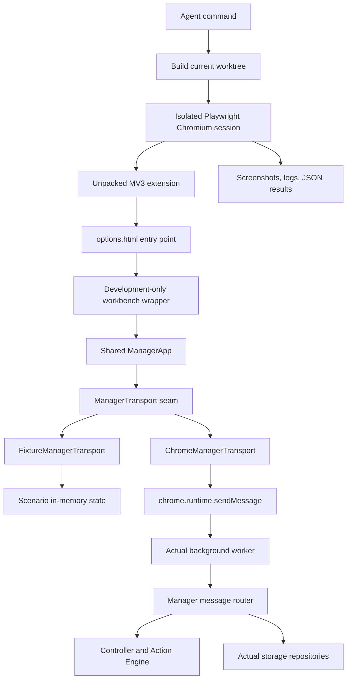

# TabRoute — Agent Development Workbench Design

**Status:** Approved design; implementation is the next enabling task and is deliberately out of scope for this change.

**Purpose:** Give every development agent a deterministic, isolated way to build, open, inspect, and test the shared TabRoute manager without using the user's Chrome profile or manually preparing browser storage.

## 1. Decision summary

The development workbench wraps the existing options entry point. It is not a second application and it does not replace the manager. `ManagerApp` remains the one shared manager module used by the popup, the normal options page, and the workbench options page.

The workbench has two transport modes:

- **Fixture mode** uses deterministic in-memory state. It records typed commands, applies controlled latency and failures, and can reset to the selected scenario.
- **Real mode** uses the actual MV3 background worker, storage repositories, controller, Action Engine, and typed manager messages through `chrome.runtime.sendMessage`.

The workbench is a development and test build concern. Workbench controls, fixture data, fixture adapters, debug hooks, and scenario registries are excluded from production output by build-time dead-code elimination. The production options page remains the ordinary `ManagerApp` with the real Chrome transport.

The workbench owns test execution infrastructure, not feature persistence. It does not implement Sync generations, Local last-valid shadows, Activity, Undo, snapshot storage, session-state policy, or any other feature storage behavior. Its initial acceptance exercises only repository and worker behavior that exists when this enabling issue starts. Feature-specific issues add their own real-mode tests by plugging into the runner and isolated extension profile.

This task must be inserted before the remaining UI-heavy issues. It enables those issues to ship fixture coverage, public-behavior tests, browser evidence, and screenshots as part of the same change.

## 2. Scope and constraints

The workbench must:

- render the same manager module that production renders;
- support the current fixed 520 × 600 manager contract;
- expose route, scenario, deep-link, mode, delay, failure, and reset controls;
- show a typed command log for fixture and real manager requests;
- cover loading, slow, validation, and offline states without manual storage edits;
- run against the current worktree after building it;
- start Playwright's bundled Chromium with a fresh temporary persistent profile;
- load the unpacked MV3 build, wait for the worker and manager to be ready, derive the extension ID, open the options workbench, and emit evidence;
- provide worker, extension-profile, and restart capability for later real-mode tests without owning feature storage semantics; and
- leave temporary profiles and evidence in ignored, cleaned locations.

The workbench must not:

- add a second manager implementation or duplicate manager pages;
- call `chrome.tabs.group`, `chrome.tabs.move`, `chrome.tabs.ungroup`, `chrome.tabs.remove`, or `chrome.tabGroups.update` from UI or workbench controls;
- bypass the typed background protocol, controller, or Tab Action Engine;
- use the user's Chrome, an existing Chrome profile, `chrome://extensions`, toolbar interaction, Computer Use, or manually edited storage as an ordinary agent workflow;
- add Firefox, cross-browser behavior, Incognito behavior, a side panel, notifications, analytics, cloud storage, or a production debug mode; or
- change the Chrome-only Manifest V3 v1 boundary.

The workbench may use browser automation APIs inside its agent-owned Chromium session. A final branded-Chrome release check is a separate human activity and is not an agent prerequisite for ordinary UI work.

## 3. Existing context and design fit

The current repository already provides the required starting seams:

- `entrypoints/popup/App.tsx` and `entrypoints/options/App.tsx` both render `ManagerApp`.
- `src/ui/manager/ManagerApp.tsx` accepts an injectable `ManagerTransport`.
- `src/ui/manager/useManagerState.ts` queries and sends typed manager messages.
- `src/ui/manager/types.ts` defines `ManagerMessage`, `ManagerResponse`, manager routes, and the fixed view metadata.
- `src/background/managerMessageRouter.ts` validates commands, serializes mutations, persists accepted configuration, replaces controller configuration, and returns the accepted state.
- `entrypoints/background.ts` attaches the router to the MV3 worker.
- `src/chrome/liveChromePort.ts` is the existing adapter for fresh Chrome inventory and Action Engine mutations.
- Vitest component tests already cover manager shell, navigation, options usage, and the message router.
- Playwright is already a development dependency, but there is no current workbench harness in `tests/e2e` or `scripts`.

The workbench therefore deepens an existing seam instead of introducing a parallel UI architecture. Its leverage comes from exercising the same manager interface through two adapters. Its locality comes from keeping browser setup, scenario construction, and evidence generation in the harness rather than spreading test conditionals through manager pages.

## 4. Architecture



### 4.1 Modules and seams

**`ManagerApp` module.** Owns manager navigation, page composition, route focus, and manager UI behavior. It knows only the `ManagerTransport` interface and manager view inputs. It does not know whether state is fixture or real. It never imports a repository, Chrome port, Playwright, or fixture registry.

**`ManagerTransport` interface.** This is the external seam crossed by the manager and by public-behavior tests. It has one request operation for a typed `ManagerMessage` and returns a typed `ManagerResponse`; transport failures are represented as stable typed failures rather than unhandled strings. The interface includes the response invariants, command ordering, error modes, and the requirement that accepted commands return the accepted configuration.

The interface remains small. Workbench-only controls do not become manager responsibilities. Fixture reset, latency, failure injection, command-log inspection, and pending-response release are exposed through a separate typed workbench control interface implemented by the fixture adapter and by the real-session evidence collector.

**`ChromeManagerTransport` adapter.** Satisfies `ManagerTransport` by sending `manager-query` and `manager-command` messages to the actual background worker. It does not read or mutate Chrome state itself. The worker and repositories remain responsible for actual storage, controller replacement, reconciliation, and Action Engine behavior. A missing response, `runtime.lastError`, or worker timeout becomes a typed transport failure for the manager and a structured event in the command log.

**`FixtureManagerTransport` adapter.** Satisfies `ManagerTransport` with deterministic in-memory state. It uses the same typed command vocabulary and the same domain/router behavior at the seam. Its repository and controller doubles keep the accepted configuration in memory. It records every request with sequence number, message kind, command kind, scenario, start/end time, latency, result, and error. It supports deterministic UUID and clock functions, configured delay, controlled failure mode, reset to the scenario seed, and a typed `releasePending()` operation. `releasePending()` releases all currently blocked fixture responses in sequence and returns exactly `{ released: Array<{ requestId: string; finalState: "resolved" | "rejected" }> }`; tests may call it directly through the typed adapter control, while users call the visible **Release pending response** control. It never imports or calls the live Chrome port.

The fixture control interface is typed and testable:

```ts
interface FixtureManagerControls {
  releasePending(): Promise<{
    released: Array<{ requestId: string; finalState: "resolved" | "rejected" }>;
  }>;
  reset(): Promise<void>;
  setLatency(milliseconds: number): void;
  setFailure(policy: FixtureFailurePolicy): void;
  commandLog(): readonly FixtureCommandRecord[];
}
```

`releasePending()` is a control operation, not a `ManagerMessage`, and is unavailable to `ChromeManagerTransport`. It does not mutate configuration by itself. It only allows queued fixture responses to settle and always returns the exact typed result shape shown above. If no response is queued, it returns `{ released: [] }` and changes nothing. A resolved entry means the queued request received its normal response; a rejected entry means the queued request settled with its configured typed failure.

**`WorkbenchHost` module.** Exists only in the workbench build. It owns the 520 × 600 preview frame, controls, URL synchronization, scenario selection, mode selection, command log, and screenshot/evidence markers. It renders `ManagerApp` as its child. It may remount the manager after a mode or scenario change, but it does not copy or reimplement manager pages.

**`ScenarioRegistry` module.** Exists only in the workbench build. It maps stable scenario IDs to deterministic seeds, route, deep-link, expected visible state, and optional interaction setup. Scenario data is code or test data reachable only from the workbench build entry graph.

**`Workbench runner` module.** Runs outside the extension page. It builds the current worktree, creates the isolated profile, launches bundled Chromium, loads the unpacked extension, derives the extension ID, opens the options URL, waits for readiness, drives the page, captures evidence, writes machine-readable results, and cleans temporary state.

### 4.2 Ownership rules

The workbench does not weaken the existing architecture:

- UI sends typed manager commands only.
- The background worker owns configuration persistence and manager command serialization.
- The controller owns routing and reconciliation decisions.
- The Tab Action Engine is the only module allowed to mutate Chrome tabs and groups.
- Chrome runtime IDs remain session associations, never durable identity.
- MV3 worker globals remain caches; durable state stays in the designated storage area.
- Real mode reads fresh Chrome inventory through the existing adapter before any mutation and verifies postconditions through the existing Action Engine path.

## 5. Data flow

### 5.1 Fixture request

1. The runner opens `options.html` with a workbench URL.
2. The options entry point selects the fixture adapter from the build-time workbench gate and URL mode.
3. `WorkbenchHost` creates or resets the selected fixture adapter from the scenario registry.
4. `ManagerApp` sends a typed query through the transport seam.
5. The fixture adapter applies the configured delay and failure policy, then returns the seeded configuration and view state or a typed failure. The `loading` scenario deliberately holds the first manager query in a pending queue instead of returning.
6. A manager command is recorded before execution, applied to the in-memory router/controller double, and recorded with its accepted result or failure.
7. The manager re-renders from the returned accepted state. The host command log updates without changing manager behavior.

For the `loading` scenario, the page remains in `loading` and the host shows an enabled **Release pending response** button while the first query is queued. A click calls `FixtureManagerTransport.releasePending()`. The same operation is available to Playwright and Vitest through `FixtureManagerControls`. After release, a successful query transitions `loading` to `ready`; a typed failure transitions it to `error`. The workbench manager-ready marker is emitted only after that first query settles. A pending query is not ready.

### 5.2 Real request

1. The runner opens the same options entry point in the isolated extension profile.
2. The options entry point selects `ChromeManagerTransport`.
3. `ManagerApp` sends `manager-query` or `manager-command` over `chrome.runtime.sendMessage`.
4. The actual MV3 worker receives the message through `chrome.runtime.onMessage` and calls the existing manager router.
5. The router validates the current configuration, applies the typed command, persists it through the configured repository, replaces controller state, and returns the accepted state.
6. Any resulting Chrome changes continue through the controller and Tab Action Engine. The UI does not call Chrome mutation APIs.
7. The runner and workbench host record the message, response, worker console output, page console output, and screenshot evidence.

### 5.3 Reset and isolation

Fixture reset discards the in-memory configuration, command log, virtual clock, pending response releases, failure counters, active failure policy, and pending latency, then recreates the selected scenario seed. It does not reload production storage.

Real reset closes and recreates the extension page or starts a new isolated run. It does not clear the user's profile because the user's profile is never opened. A real-mode test that needs a known state creates it through typed manager commands or starts a new temporary profile.

### 5.4 Feature-owned real-mode extensions

The runner supplies a real extension page, the actual MV3 worker target, isolated profile lifecycle, typed manager messaging, browser restart controls, console capture, and evidence output. It does not supply feature persistence implementations or assertions. A feature issue that adds Sync generations, Local shadows, Activity, Undo, snapshots, or another storage contract adds its own repository fixtures, real-mode setup, commands, assertions, and screenshots by plugging into this runner. The enabling workbench accepts only the repository behavior already present at the start of its implementation.

Every run has a unique run ID, a worktree-local build path, an OS temporary profile path, and a worktree-local artifact directory at `.workbench/artifacts/<run-id>`. The `.workbench/artifacts/` root is ignored by Git. The runner records all four paths in `results.json` and always treats the temporary profile as a cleanup target. The global artifact budget is 200 MB across active, abandoned, and completed runs. Each active run has a 50 MB hard budget, including its screenshots, traces, videos, text logs, and required metadata. Text logs are rotated and capped at 5 MB per run. Terminal evidence is retained for at most 20 terminal runs and at most seven days. Failure evidence follows the same limits.

The runner applies one deterministic artifact-enforcement sequence before and during every evidence write, including log, screenshot, trace, video, result, and error writes:

1. Prune terminal runs older than seven days. Then enforce the 20-terminal-run count by pruning terminal runs in ascending `terminalAt` order, with lexical `runId` as the tie-break.
2. Enforce the 50 MB limit for the affected active run. Evict only optional artifacts from that run in category order: video segments, traces, then screenshots. Within every category, sort candidates by `capturedAt` ascending, then lexical `runId`, then lexical `relativePath`. Rotate text-log segments and cap the combined text logs at 5 MB per run. Never evict lease, status, result, or error metadata.
3. Enforce the 200 MB global limit across active, abandoned, and completed runs. First prune remaining terminal runs by ascending `terminalAt`, with lexical `runId` as the tie-break. If the global limit still cannot fit the write, evict optional artifacts across active runs using the same category order and `capturedAt`/`runId`/`relativePath` ordering from step 2. Never evict lease, status, result, or error metadata.
4. If required evidence still cannot fit within the affected active-run limit or the global limit, stop that run with `{ "ok": false, "code": "WORKBENCH_ARTIFACT_LIMIT" }`, perform normal profile cleanup, and retain a bounded failure `results.json` with status, lease, result, error, and cleanup metadata. Required metadata has reserved space within both budgets and is written even when optional evidence is removed.

Cleanup first attempts to remove temporary profiles and transient artifacts. If cleanup fails, it retries exactly three times after 250 ms, 500 ms, and 1000 ms. After the third retry, the command returns a machine-readable `WORKBENCH_CLEANUP_FAILED` result containing the retained path and exits non-zero. The retained path remains subject to the same artifact bounds and is retried by the next pruning pass.

### 5.5 Run leases and interrupted-run reaping

Each run owns `.workbench/artifacts/<run-id>/lease.json` with at least these fields:

```json
{
  "runId": "<run-id>",
  "pid": 12345,
  "startedAt": "<timestamp>",
  "heartbeat": "<timestamp>",
  "profilePath": "<temporary-profile-path>",
  "status": "active"
}
```

The runner creates the lease before launching Chromium and updates `heartbeat` every five seconds. At launcher startup and during normal shutdown, it scans all leases. A lease is reapable when its heartbeat is older than two minutes and process-liveness inspection says its `pid` is no longer alive. Reaping removes the orphan profile and transient run resources with the same three cleanup attempts and 250/500/1000 ms backoff, marks the run `abandoned` in its results, and subjects its retained evidence to the 20-run, 200 MB, and seven-day bounds. An abandoned run is terminal for retention and pruning purposes.

If process-liveness inspection is unavailable, the runner uses a conservative rule: a lease with a heartbeat age of ten minutes or less is non-stale and is not reaped; a lease older than ten minutes is stale and may be reaped. A liveness error is recorded in the reaping result. If cleanup of an orphan profile still fails after the three retries, the reaper records `WORKBENCH_CLEANUP_FAILED` with the retained profile path and continues to bound the abandoned evidence.

Before starting a new run, the launcher reaps eligible leases and then counts non-stale active leases. It permits at most eight. If eight non-stale active leases remain, it does not launch another browser and returns `{ "ok": false, "code": "WORKBENCH_CAPACITY" }`. The current run's lease is removed only after normal cleanup. The current run profile is always cleaned on exit: the runner performs the cleanup attempts, and if the operating system retains it after all attempts, the command returns `WORKBENCH_CLEANUP_FAILED` with that path and leaves the lease marked `abandoned` for the next reaping pass.

## 6. URL and deep-link contract

The canonical workbench URL is:

```text
chrome-extension://<extension-id>/options.html?workbench=1&mode=fixture&route=groups&scenario=wb%3Adefault&deep-link=none&latency=0&failure=none
```

The extension ID is always derived from the launched session. It is never configured, stored, or copied from another run.

Query parameters have the following exact contract:

| Parameter | Allowed values | Meaning |
|---|---|---|
| `workbench` | `1` | Development-build gate. In a production build it has no effect and no workbench modules are present. |
| `mode` | `fixture`, `real` | Selects `FixtureManagerTransport` or `ChromeManagerTransport`. Fixture is the default for the interactive workbench. |
| `route` | `groups`, `rules`, `activity`, `settings` | Selects the shared manager's primary route. |
| `scenario` | A ScenarioRegistry ID prefixed with `wb:` | Selects deterministic fixture seed and expected state. Real mode accepts only `wb:default`; it never silently seeds fixture data. IDs are URL-encoded when written. |
| `deep-link` | `none`, `new-rule`, `edit-rule:<uuid>`, `confirm-delete:<uuid>` | Selects an existing manager subview or overlay after the primary route is loaded. Snapshot and Diagnostics subviews are not part of this initial contract; their owning issues add them to the extensible registry. Values are URL-encoded when written. |
| `latency` | Integer `0` through `5000` | Fixture response delay in milliseconds. Real mode accepts only `0`; real timing is controlled by the worker and test timeout. |
| `failure` | `none` or `<mode>[:<scope>]`, where mode is `query`, `command`, `validation`, or `offline`, and scope is `once` or `persistent` | Fixture failure policy. An omitted scope means `persistent`. Real mode accepts only `none`; real failures come from the actual worker or browser session. |

Unsupported parameters and invalid values are rejected by the runner with a machine-readable argument error. They are not silently converted to a different scenario. The workbench controls update the URL with `history.replaceState` and apply the same validation rules.

`FixtureFailurePolicy` is the typed form of the `failure` parameter:

```ts
type FixtureFailurePolicy =
  | { mode: "none" }
  | { mode: "query" | "command" | "validation" | "offline"; scope: "once" | "persistent" };
```

Failure matching is exact. `query` matches only `manager-query`. `command` matches every non-query `manager-command`. `validation` matches mutating commands and returns a typed validation rejection without applying or persisting the command. `offline` rejects every request, including queries and commands, with a typed offline failure. A `once` policy is consumed after the first matching request; non-matching requests do not consume it. A `persistent` policy remains active until the failure control changes it or reset clears it. `none` never injects a failure.

Normal production options URLs do not contain workbench controls. A production page opened with workbench query parameters renders the normal manager and ignores the parameters because the workbench build gate is absent.

## 7. Scenario registry

The initial registry contains these stable IDs:

| ID | Route/deep link | Seed and purpose |
|---|---|---|
| `wb:default` | `groups` / `none` | Default fallback group, one managed group, and the normal ready state. |
| `wb:empty-groups` | `groups` / `none` | No non-fallback groups; proves the empty group navigator and create-group path. |
| `wb:dense-groups` | `groups` / `none` | Enough groups to require navigator scrolling and selected-group preservation. |
| `wb:enabled-group` | `groups` / `none` | Selected managed group with enablement on and its normal inspector controls. |
| `wb:disabled-group` | `groups` / `none` | Selected non-fallback group with enablement off and its disabled-state explanation. |
| `wb:empty-persistent-tabs` | `groups` / `none` | Selected persistent group with no persistent-tab definitions. |
| `wb:populated-persistent-tabs` | `groups` / `none` | Selected persistent group with ordered definitions and accepted URL patterns. |
| `wb:mixed-rules-overview` | `rules` / `none` | Enabled, paused, disabled, grouped, and ungrouped rules for overview filters and counts. |
| `wb:new-rule` | `rules` / `new-rule` | New flat rule editor with deterministic defaults and no saved mutation before submit. |
| `wb:edit-rule` | `rules` / `edit-rule:<fixture-rule-uuid>` | Existing rule editor with stable fixture rule identity and populated fields. |
| `wb:confirmation-overlay` | `rules` / `confirm-delete:<fixture-rule-uuid>` | Delete confirmation overlay with focus, Escape, cancel, and confirm states. |
| `wb:loading` | `groups` / `none` | Initial query remains loading until the deterministic fixture response is released. |
| `wb:slow` | `groups` / `none` | Ready state after a configured non-zero delay; proves status and timeout separation. |
| `wb:validation-error` | `rules` / `new-rule` | Typed validation failure from a save attempt while preserving the last valid state. |
| `wb:offline` | `groups` / `none` | Transport offline failure with recoverable retry/reset behavior. |

The registry uses deterministic UUIDs, timestamps, group ordering, rule ordering, persistent-tab ordering, and labels for manager data that exists when the issue starts. It does not use `Date.now()`, random UUIDs, the user's storage, or live Chrome inventory. It does not define Activity, Undo, Sync, Local-shadow, snapshot, or other feature-storage fixtures.

Scenario setup is expressed as state and manager inputs, not as page-specific test code. When a future UI issue adds a screen or state, it adds a registry entry or extends an existing seed with a named expected behavior. It does not add conditional markup to make the workbench look like the screen.

The route/scenario registry is extensible through owned definitions. The enabling task registers only the four current primary routes and the initial deep links listed above. `activity` is already a registered primary route. A later Activity issue adds its fixtures, public behavior, workbench interactions, and screenshot evidence to that existing route; it does not register the route. Later Snapshots and Diagnostics issues add their own route or subview, seed data, deep link, public-behavior tests, real-mode storage/lifecycle tests, and screenshots in those issues. The enabling task does not reserve or accept those unimplemented routes.

## 8. Workbench controls and evidence

The host controls occupy the workbench frame outside the manager preview. The preview itself remains exactly 520 × 600 CSS pixels and is the subject of screenshots. Controls include:

- mode switch: Fixture or Real;
- scenario selector;
- route selector;
- deep-link selector or UUID input for the selected scenario;
- latency input and failure mode/scope selectors in fixture mode;
- **Release pending response**, enabled when the fixture has one or more queued responses;
- Reset button;
- command log with sequence, message/command kind, state, latency, and error; and
- screenshot and run-result status.

The host exposes stable test selectors and accessible labels for every control. The manager preview is marked with its exact dimensions, and the runner checks the computed width and height before capturing a screenshot. The host does not inject CSS into the manager or alter manager scroll ownership.

Each run emits:

- one or more PNG screenshots named by route, scenario, mode, and sequence;
- a text log containing runner, worker, page, and transport events;
- `results.json` containing run ID, worktree path, build path, profile path, extension ID, mode, URL, scenario, route, deep link, command records, readiness timestamps, screenshot paths, test assertions, and cleanup status; and
- a failure report when any readiness, assertion, screenshot, or cleanup step fails.

The evidence directory is under an ignored workbench artifact root. A successful command prints the results path and a short summary. A failed command exits non-zero after writing the machine-readable failure result.

## 9. Agent-owned browser session

The agent runner is the only ordinary path to browser verification.

### 9.1 Startup sequence

1. Resolve the current worktree and refuse to use a different checkout.
2. Build the current worktree using the requested production or workbench build mode.
3. Create a unique temporary persistent profile under the operating system temporary directory.
4. Launch Playwright's bundled Chromium with the unpacked MV3 extension loaded from the current worktree build output. Use a persistent context so extension storage and worker restart behavior are real within the run.
5. Do not pass the user's Chrome executable, profile directory, remote debugging endpoint, or an existing browser session. Do not open `chrome://extensions`.
6. Wait for the extension service worker target. Derive `<extension-id>` from the worker URL, validate the `chrome-extension://` origin, and record the ID only in the run result.
7. Open the canonical options URL in a new extension page.
8. Apply the bounded readiness protocol. A non-loading run must discover the worker and settle the first manager query before it is ready. A page that renders HTML without a settled manager query is not ready.
9. Apply route, scenario, deep-link, latency, and failure controls only through the workbench URL or visible controls.
10. Run assertions, capture screenshots and logs, write `results.json`, and clean the temporary profile and transient artifacts.

### 9.2 Readiness and restart

Readiness has two phases and exact deadlines:

1. **Worker target:** start a 15,000 ms deadline when the runner begins waiting for the extension service-worker target. If no target is discovered before the deadline, write `{ "ok": false, "code": "WORKBENCH_WORKER_TIMEOUT", "phase": "worker" }` to `results.json`, exit non-zero, and clean up.
2. **Manager query:** start a separate 5,000 ms deadline immediately after worker target discovery. Send the first typed `manager-query` and wait for the manager page to receive its response. During this deadline, retry only the startup race whose error text contains the exact case-insensitive phrase `receiving end does not exist`, at 250 ms cadence. The 5,000 ms deadline is not extended by retries. Any other error is non-retryable, is recorded with its original typed/error details, and is returned immediately; it is never swallowed.

The development build emits a workbench-only readiness marker after the first manager query settles. A successful response transitions the manager from `loading` to `ready`; a typed validation, reference, persistence, offline, or other expected response transitions it to `error` while still marking the query phase settled. The `loading` fixture intentionally has no settled response until `releasePending()` runs, so it remains `loading` and emits a `manager-pending` marker. Its test releases the response and then waits for the normal manager-ready marker. The marker includes the selected mode, scenario, route, and transport status. It is not present in production output.

If the manager-query deadline expires, write `{ "ok": false, "code": "WORKBENCH_MANAGER_TIMEOUT", "phase": "manager-query", "workerDiscoveredAt": "<timestamp>" }` to `results.json`, exit non-zero, and clean up. The worker and manager timeout codes are distinct and stable for automation.

Real restart coverage terminates the extension worker target through the isolated browser automation session or waits for normal MV3 idle termination, then sends a new typed manager query. The test proves that the worker reconstructs state from the configured storage repositories and does not rely on worker globals. It never uses `chrome://extensions` to stop or reload the worker.

The runner treats a worker target that starts before the page as normal. It waits for a new target when the worker is terminated and records both worker generations in the evidence.

### 9.3 Process and artifact isolation

The runner uses one temporary profile per invocation and one run ID per profile. Parallel agents use different profiles and ports, and do not share storage, cookies, extension IDs, or output folders. The build command always targets the current worktree. A stale output directory is removed or replaced only after its resolved path is verified to be the current worktree's build output.

Temporary profile, Playwright report, trace, and transient screenshot paths are ignored and cleaned. Retained evidence is copied to a run-specific ignored directory and never written over another agent's result.

## 10. Commands

The implementation may choose the exact script file names, but these command names and behaviors are required:

| Command | Required behavior |
|---|---|
| `npm run workbench` | Build the current worktree in workbench mode, launch an isolated bundled Chromium session, open fixture-mode options with the canonical default scenario, keep the session available for agent inspection, and emit logs/results. |
| `npm run workbench:real` | Perform the same isolated startup sequence in real mode. Use actual worker/storage/typed commands and never seed fixture state. |
| `npm run test:workbench` | Run fixture-mode Playwright tests for all initial scenarios, route navigation, deep links, focus order, scroll ownership, latency/failure/reset behavior, exact preview size, command log, and screenshots. |
| `npm run test:extension` | Build the production extension, run the production-output scan, then run the real bundled-Chromium tests registered for the current issue. The enabling task registers messaging, worker restart, options, popup, and profile isolation; feature issues plug their own storage and Sync tests into the same runner. |
| `npm run smoke:popup` | Build the current worktree, load it in an isolated bundled-Chromium profile, open the actual popup entry point, verify the shared manager starts at Groups at 520 × 600, and emit one screenshot and machine-readable result. It does not use the workbench controls. |

All commands fail fast on build or readiness failure, return a non-zero exit code for an assertion failure, and print the result path. No command relies on a pre-running development server, an existing browser, manually prepared storage, or a fixed extension ID.

## 11. Testing matrix

| Area | Test form | Required proof |
|---|---|---|
| Public manager behavior | Vitest with Testing Library and typed transport doubles | Shared manager renders through either adapter; route changes, focus target, 520 × 600 metadata, commands, accepted state, validation errors, offline state, and reset behavior are observable through the public interface. |
| Fixture transport | Vitest | Deterministic seeds, UUIDs, timestamps, command ordering, latency, controlled failures, reset, and no live Chrome imports. |
| Fixture UI | Playwright bundled Chromium | Every initial scenario loads; route and deep-link controls work; focus moves to the manager route target; only the intended body scrolls; overlays trap/restore focus as specified; screenshots are captured at exact preview size. |
| Fixture evidence | Playwright and result-schema assertions | Command log, screenshots, console logs, route/scenario/mode metadata, and machine-readable results are complete and tied to one run ID. |
| Real manager messaging | Playwright bundled Chromium | Options and popup send typed queries/commands to the actual worker; worker responses are accepted state; no UI module calls a Chrome mutation API. |
| Existing repository behavior | Playwright extension page plus manager commands | The enabling task verifies only configuration behavior and persistence paths that exist when the issue starts. Invalid commands do not replace valid state. It does not add new storage semantics. |
| Worker restart | Playwright/CDP isolated session | Worker termination and wake-up leave the current repository behavior available; a new worker answers the typed manager query without relying on previous globals. Feature issues add assertions for any new durable or session state they introduce. |
| Feature-owned storage and lifecycle | Later issue using the same runner | An issue that adds Sync, Local shadows, Activity, Undo, snapshots, or another storage contract adds its own isolated real-mode setup, assertions, and evidence. Those tests are not acceptance criteria for the enabling workbench. |
| Popup smoke | Playwright bundled Chromium | The real popup entry point uses the same `ManagerApp`, starts on Groups, has exact viewport dimensions, and produces screenshot evidence. |
| Production exclusion | Build output scan | The entire built `.output/chrome-mv3` tree contains none of the exact workbench-only markers, no `wb:` scenario ID, and no production HTML or manifest entry named `workbench`. `ChromeManagerTransport` and ordinary words such as `default`, `loading`, and `offline` are allowed. |
| Release check | One final human check in branded Chrome Stable | The production build loads as an unpacked MV3 extension, the Action/permission surface is correct, popup and options open, and no workbench UI appears. This is the only check allowed to use the branded Chrome extension-management UI. |

Vitest tests verify public behavior and transport contracts. They must not inspect private React implementation details to claim browser behavior. Playwright tests verify rendered navigation, focus, scrolling, overlays, screenshots, extension messaging, and the lifecycle capability registered by the current issue. Feature-specific storage behavior is tested only by the issue that owns it. The two levels are complementary and neither is a substitute for the other.

## 12. Production exclusion and release scan

The build has two explicit graphs:

- **Production graph:** normal WXT Chrome MV3 build, popup and options entry points, `ManagerApp`, `ChromeManagerTransport`, background worker, domain/controller/Action Engine, and production CSS/assets.
- **Workbench graph:** the production graph plus the development-only wrapper, fixture adapter, scenario registry, controls, result markers, runner support, and fixture assets.

The production graph must not import the workbench graph. Build-time constants must make the workbench branch unreachable in a production build. Because the workbench markers are exact and workbench-only, the production-build assertion recursively scans the entire built `.output/chrome-mv3` tree for their exact UTF-8 marker bytes. This covers the background worker, content scripts, extension pages, popup, options page, lazy chunks, styles, and every other emitted production asset, including assets not reachable from popup/options HTML.

The scan fails if any reachable asset contains one of these exact workbench-only markers:

- `TABROUTE_DEV_WORKBENCH_V1`;
- `data-workbench-control`;
- `tabrouteFixtureRegistryV1`; or
- a scenario ID matching `wb:[a-z0-9-]+`.

The workbench build must emit those markers so the scan tests the intended exclusion seam. `ChromeManagerTransport` and ordinary words such as `default`, `loading`, and `offline` are explicitly allowed. Separately, the assertion parses the production manifest and fails if it contains an entrypoint key, entrypoint name, or referenced HTML path named `workbench`; it also fails if the production tree contains an HTML entrypoint whose basename is `workbench`. The manifest assertion is independent of the byte scan. A production build may contain the ordinary options and popup entrypoints only.

The scan also checks that production remains Chrome-only, Manifest V3, `incognito: not_allowed`, and free of new permissions or commands that are not approved by the TabRoute design. A scan failure blocks `test:extension` and the release check.

## 13. Future UI issue contract

Every future UI issue that changes a manager screen must add all of the following in the same work:

1. A deterministic fixture or an explicit extension of an existing scenario.
2. A Vitest public-behavior test through the manager or transport interface.
3. A workbench Playwright test covering the user-visible route, interaction, focus, scroll, error, or overlay behavior.
4. Screenshot evidence at the exact 520 × 600 preview size, with scenario, route, mode, and run ID recorded.
5. A production-scan assertion when the issue adds workbench-only data or controls.

An issue is not UI-complete when only a component test or a static screenshot exists. The fixture, public behavior, workbench behavior, and screenshot must agree on the same user-facing contract.

## 14. Delivery order and rollout

The workbench is the next enabling task before remaining UI-heavy issues.

### Phase 1 — Harness seam

Add the small transport/control interfaces, `ChromeManagerTransport`, `FixtureManagerTransport`, deterministic scenario registry, build-time workbench gate, URL parser, result schema, and production scan. Keep `ManagerApp` behavior unchanged except for the smallest injection needed to supply the selected transport and initial deep link.

### Phase 2 — Agent runner

Add the current-worktree build and isolated bundled-Chromium runner. Prove extension ID discovery, worker/manager readiness, options loading, profile isolation, write-time artifact budgets, log rotation, artifact eviction, cleanup, and the five required commands. Add the initial fixture Playwright suite and popup smoke.

### Phase 3 — Real lifecycle coverage

Add real-mode messaging, worker restart, extension-profile lifecycle, and persistence tests for repository behavior that already exists. Keep setup inside the isolated profile and typed extension interfaces. Add the production-output scan to the extension gate. Do not implement Sync generations, Local shadows, Activity, Undo, snapshots, or other feature storage here. Later feature issues plug their own real-mode tests into the runner.

### Phase 4 — UI issue adoption

Before each remaining UI-heavy issue starts, register its fixture state and acceptance evidence. The issue's implementation and tests use the same workbench route and deep-link contract. The coordinator reviews screenshots and machine-readable results with the code diff.

### Phase 5 — Release and maintenance

Run the full production gate, then perform the one final branded-Chrome manual release check. Keep the workbench commands available for future agent work; they are not a user-facing product feature.

## 15. Removal path

If the workbench is removed after v1, remove the development-only wrapper, fixture adapter, scenario registry, runner scripts, fixture assets, workbench-only tests, artifact ignore rules, and production-scan implementation. Remove the workbench build flag and URL handling from the options entry point. Keep `ManagerApp`, the `ManagerTransport` seam, `ChromeManagerTransport`, typed manager messages, and real extension tests that still protect production behavior.

Removal must be a separate approved change. It must first prove that no active UI issue or release script depends on fixture IDs, workbench screenshots, or the workbench command names. It must not collapse the manager into separate popup/options implementations.

## 16. Explicit non-goals

- The workbench is not a second product application, a replacement for the popup, or a replacement for the options page.
- It is not a visual design tool, Figma renderer, browser extension debugger, or general Chrome automation framework.
- It does not make fixture state available to production users.
- It does not expose arbitrary JavaScript evaluation or arbitrary Chrome API mutation controls.
- It does not replace Vitest public-behavior tests, real extension tests, or the final branded-Chrome release check.
- It does not guarantee pixel parity with every screen size; the supported manager evidence contract is exactly 520 × 600.
- It does not implement Sync generations, Local last-valid shadows, Activity, Undo, snapshots, or any other feature storage. It provides the isolated runner that their owning issues use to test those contracts.
- It does not make service-worker memory durable; it tests only the persistence behavior already present in the current repository.
- It does not persist Chrome runtime tab, group, or window IDs.
- It does not introduce a new routing engine, storage model, controller, Action Engine, or UI state store.
- It does not change the approved Chrome permissions, MV3 lifecycle model, session invariants, or Action Engine/controller boundaries.

## 17. Acceptance criteria

The enabling task is accepted only when all criteria below are true:

1. Popup, normal options, and workbench options render the same `ManagerApp` module.
2. Fixture and real modes both cross the same typed `ManagerTransport` seam.
3. Fixture mode is deterministic, records commands, supports latency, supports controlled failures, and resets without storage or Chrome access.
4. Real mode uses the actual background worker, repositories, typed commands, controller, and Action Engine.
5. The canonical URL contract supports mode, route, scenario, deep link, latency, and failure with strict validation.
6. All initial scenarios are registered and covered by fixture UI tests. The loading scenario exposes **Release pending response**, and `releasePending()` returns exactly `{ released: Array<{ requestId: string; finalState: "resolved" | "rejected" }> }`.
7. The preview is verified as exactly 520 × 600, with route focus and feature-owned scrolling covered by browser tests.
8. The agent runner builds the current worktree, launches bundled Chromium with a fresh temporary persistent profile, derives the extension ID, waits for worker/manager readiness, emits screenshots/logs/results, creates five-second-heartbeat leases, reaps eligible interrupted runs, enforces eight non-stale active leases, and cleans temporary artifacts.
9. No ordinary workflow uses the user's Chrome, `chrome://extensions`, toolbar, Computer Use, manual storage setup, fixed extension ID, or a pre-running server.
10. Real bundled-Chromium tests cover current manager messaging, worker restart, popup, options, and profile isolation. Feature-specific storage and Sync tests are explicitly owned by the issues that add those features and plug into this runner.
11. Production output scan recursively scans the entire built `.output/chrome-mv3` tree for the exact markers `TABROUTE_DEV_WORKBENCH_V1`, `data-workbench-control`, `tabrouteFixtureRegistryV1`, and `wb:` scenario IDs, covering background workers, content scripts, extension pages, lazy chunks, and all other emitted assets. It separately parses the production manifest and rejects any workbench-named entrypoint or production HTML entrypoint named `workbench`. `ChromeManagerTransport`, `default`, `loading`, and `offline` remain allowed.
12. Every future UI issue has a documented fixture, public-behavior test, workbench test, and screenshot evidence requirement.
13. The workbench is documented as the next enabling task before remaining UI-heavy issues, with no Linear mutation performed by this design task.
14. A final branded-Chrome manual release check is defined as the only human browser-management step.
15. The enabling implementation does not add Sync generations, Local shadows, Activity, Undo, snapshots, or other feature storage; it provides the runner and lifecycle seam for their owning issues.
16. The runner returns `WORKBENCH_WORKER_TIMEOUT`, `WORKBENCH_MANAGER_TIMEOUT`, `WORKBENCH_CLEANUP_FAILED`, and `WORKBENCH_CAPACITY` with machine-readable results under their defined conditions.
17. Artifact checks run during writes, enforce 50 MB per active run and 200 MB globally across active, abandoned, and completed runs, cap rotated text logs at 5 MB per run, evict optional evidence in the defined order, and return `WORKBENCH_ARTIFACT_LIMIT` when required evidence cannot fit.

## 18. Specification self-review

The specification was reviewed after drafting for incomplete requirements, contradictions, ambiguity, and scope. It contains no incomplete requirements. The architecture keeps one `ManagerApp` and one transport seam. Fixture and real modes use different adapters behind that seam. Production exclusion uses an exact full-tree marker scan plus a manifest entrypoint assertion. Browser setup uses an agent-owned profile and does not depend on the user's Chrome or `chrome://extensions`. Readiness deadlines, retryable startup errors, pending-response release, exact failure matching, lease reaping, capacity, write-time artifact budgets, log rotation, and evidence eviction are explicit. Activity remains an existing primary route owned by its later feature issue. The enabling task provides runner capability without taking ownership of feature storage; later issues plug their own real-mode tests into it. The test matrix distinguishes Vitest public behavior, fixture UI, real extension lifecycle, production scanning, and the final branded-Chrome manual check. The scope is one enabling workbench task and does not implement feature code, modify Linear, or authorize a commit.
